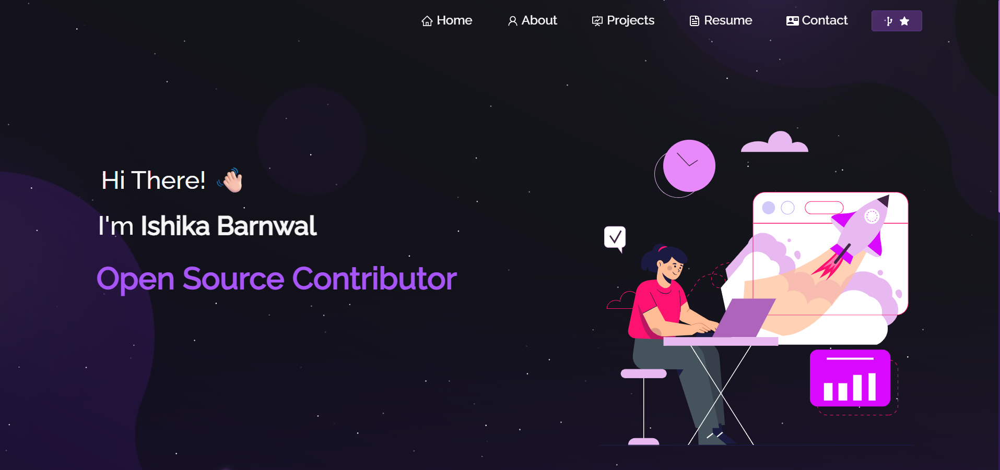

# 🌐 Ishika’s Portfolio  

<h2 align="center">  
  Portfolio Website    
  <a href="https://ishika-barnwal.vercel.app/" target="_blank">Ishika.tech</a>  
</h2>  

  
    

  

---

## 🚀 About  

This is my personal **portfolio website**, built to showcase:  

- My **projects**  
- My **technical skills**  
- My **resume**  
- Ways to **connect with me**  

It’s fully responsive and designed with a clean, modern UI.  

---

## 🛠 Built With  

This project was built using:  

- **React.js**  
- **Node.js**  
- **CSS3 / Bootstrap**  
- **Vercel** (for deployment)  
- **VS Code**  

---

## ✨ Features  

- 📖 **Multi-Page Layout**  
- 🎨 **Styled with React-Bootstrap & CSS** (easy to customize)  
- 📱 **Fully Responsive Design**  

---

